# Guia de Integração NF-e/NFC-e

Este documento descreve os passos necessários para integrar emissão de Nota Fiscal Eletrônica (NF-e) e Nota Fiscal de Consumidor Eletrônica (NFC-e) ao sistema ERP/PDV.

## 📋 Pré-requisitos

### Documentação e Certificados
- [ ] CNPJ ativo da empresa
- [ ] Certificado Digital A1 (e-CNPJ ou e-CPF do responsável)
- [ ] Credenciamento na SEFAZ do estado
- [ ] Série de numeração de notas autorizada

### Dados Cadastrais Necessários
- [ ] Regime tributário (Simples Nacional, Lucro Real, Lucro Presumido)
- [ ] Inscrição Estadual
- [ ] Inscrição Municipal (para NFS-e)
- [ ] CNAE (Classificação Nacional de Atividades Econômicas)

### Dados Fiscais dos Produtos
- [ ] NCM (Nomenclatura Comum do Mercosul) - 8 dígitos
- [ ] CEST (Código Especificador da Substituição Tributária) - quando aplicável
- [ ] CFOP (Código Fiscal de Operações e Prestações)
- [ ] CST/CSOSN (Código de Situação Tributária)
- [ ] Alíquotas de impostos (ICMS, PIS, COFINS, IPI)

## 🔌 Opções de Integração

### 1. Focus NFe (Recomendado para pequenas empresas)
**Site:** https://focusnfe.com.br  
**Preço:** A partir de R$ 49/mês  
**Vantagens:**
- API REST simples
- Homologação gratuita
- Suporte técnico
- Armazena XMLs automaticamente
- DANFE e envio por email inclusos

**Planos:**
- Micro: 50 notas/mês - R$ 49
- Pequeno: 150 notas/mês - R$ 99
- Médio: 500 notas/mês - R$ 199
- Grande: ilimitado - R$ 499

### 2. WebMania NF-e
**Site:** https://webmaniabr.com  
**Preço:** A partir de R$ 29/mês

### 3. Tiny ERP
**Site:** https://www.tiny.com.br  
**Preço:** A partir de R$ 35/mês  
**Vantagens:** ERP completo + emissão fiscal

### 4. API Brasil (OpenSource)
**Site:** https://github.com/nfephp-org/sped-nfe  
**Preço:** Gratuito (requer mais conhecimento técnico)

## 🔧 Alterações Necessárias no Sistema

### 1. Schema do Banco de Dados

Adicionar campos fiscais às tabelas existentes:

```sql
-- Adicionar campos fiscais à tabela companies
ALTER TABLE companies ADD COLUMN cnpj VARCHAR(18);
ALTER TABLE companies ADD COLUMN state_registration VARCHAR(20);
ALTER TABLE companies ADD COLUMN municipal_registration VARCHAR(20);
ALTER TABLE companies ADD COLUMN tax_regime VARCHAR(50); -- simples_nacional, lucro_real, lucro_presumido
ALTER TABLE companies ADD COLUMN cnae VARCHAR(10);
ALTER TABLE companies ADD COLUMN certificate_path TEXT;
ALTER TABLE companies ADD COLUMN certificate_password TEXT; -- Encrypted!
ALTER TABLE companies ADD COLUMN nfe_environment VARCHAR(20) DEFAULT 'homologation'; -- homologation, production
ALTER TABLE companies ADD COLUMN nfe_series INTEGER DEFAULT 1;
ALTER TABLE companies ADD COLUMN nfe_last_number INTEGER DEFAULT 0;
ALTER TABLE companies ADD COLUMN nfce_series INTEGER DEFAULT 1;
ALTER TABLE companies ADD COLUMN nfce_last_number INTEGER DEFAULT 0;

-- Adicionar campos fiscais à tabela products
ALTER TABLE products ADD COLUMN ncm VARCHAR(8); -- Obrigatório
ALTER TABLE products ADD COLUMN cest VARCHAR(7);
ALTER TABLE products ADD COLUMN cfop VARCHAR(4) DEFAULT '5102'; -- Venda dentro do estado
ALTER TABLE products ADD COLUMN cst VARCHAR(3); -- Para regime normal
ALTER TABLE products ADD COLUMN csosn VARCHAR(4); -- Para Simples Nacional
ALTER TABLE products ADD COLUMN icms_percentage DECIMAL(5,2) DEFAULT 0;
ALTER TABLE products ADD COLUMN pis_percentage DECIMAL(5,2) DEFAULT 0;
ALTER TABLE products ADD COLUMN cofins_percentage DECIMAL(5,2) DEFAULT 0;
ALTER TABLE products ADD COLUMN ipi_percentage DECIMAL(5,2) DEFAULT 0;
ALTER TABLE products ADD COLUMN origin VARCHAR(1) DEFAULT '0'; -- 0=Nacional, 1=Estrangeira, etc

-- Adicionar campos fiscais à tabela persons (clientes)
ALTER TABLE persons ADD COLUMN taxpayer_type VARCHAR(20); -- individual, company
ALTER TABLE persons ADD COLUMN state_registration VARCHAR(20);
ALTER TABLE persons ADD COLUMN municipal_registration VARCHAR(20);
ALTER TABLE persons ADD COLUMN tax_exempt BOOLEAN DEFAULT false;

-- Nova tabela para armazenar notas fiscais
CREATE TABLE fiscal_documents (
    id UUID PRIMARY KEY DEFAULT gen_random_uuid(),
    company_id UUID NOT NULL REFERENCES companies(id) ON DELETE CASCADE,
    branch_id UUID NOT NULL REFERENCES branches(id) ON DELETE CASCADE,
    
    -- Referência
    sale_id UUID REFERENCES sales(id) ON DELETE SET NULL,
    
    -- Tipo de documento
    document_type VARCHAR(10) NOT NULL, -- nfe, nfce, nfse
    model VARCHAR(2) NOT NULL, -- 55 (NF-e), 65 (NFC-e)
    series INTEGER NOT NULL,
    number INTEGER NOT NULL,
    
    -- Status
    status VARCHAR(50) NOT NULL, -- draft, processing, authorized, cancelled, rejected, denied
    authorization_key VARCHAR(44), -- Chave de acesso (44 dígitos)
    authorization_protocol VARCHAR(50),
    authorization_date TIMESTAMP,
    
    -- XMLs
    xml_sent TEXT, -- XML enviado para SEFAZ
    xml_authorized TEXT, -- XML autorizado pela SEFAZ
    danfe_url TEXT, -- URL do PDF (DANFE)
    
    -- Cliente
    customer_id UUID REFERENCES persons(id) ON DELETE SET NULL,
    customer_name VARCHAR(255),
    customer_document VARCHAR(20),
    
    -- Valores
    total_products DECIMAL(15,2) NOT NULL,
    total_discount DECIMAL(15,2) DEFAULT 0,
    total_freight DECIMAL(15,2) DEFAULT 0,
    total_insurance DECIMAL(15,2) DEFAULT 0,
    total_other DECIMAL(15,2) DEFAULT 0,
    total_icms DECIMAL(15,2) DEFAULT 0,
    total_pis DECIMAL(15,2) DEFAULT 0,
    total_cofins DECIMAL(15,2) DEFAULT 0,
    total_ipi DECIMAL(15,2) DEFAULT 0,
    total_document DECIMAL(15,2) NOT NULL,
    
    -- Observações
    additional_info TEXT,
    internal_notes TEXT,
    
    -- Cancelamento
    cancelled_at TIMESTAMP,
    cancellation_reason TEXT,
    cancellation_protocol VARCHAR(50),
    
    -- Auditoria
    issued_by UUID REFERENCES users(id) ON DELETE SET NULL,
    created_at TIMESTAMP DEFAULT CURRENT_TIMESTAMP,
    updated_at TIMESTAMP DEFAULT CURRENT_TIMESTAMP
);

CREATE INDEX idx_fiscal_documents_company ON fiscal_documents(company_id);
CREATE INDEX idx_fiscal_documents_sale ON fiscal_documents(sale_id);
CREATE INDEX idx_fiscal_documents_status ON fiscal_documents(status);
CREATE INDEX idx_fiscal_documents_authorization_key ON fiscal_documents(authorization_key);

-- Nova tabela para itens da nota fiscal
CREATE TABLE fiscal_document_items (
    id UUID PRIMARY KEY DEFAULT gen_random_uuid(),
    fiscal_document_id UUID NOT NULL REFERENCES fiscal_documents(id) ON DELETE CASCADE,
    product_id UUID REFERENCES products(id) ON DELETE SET NULL,
    
    -- Produto
    item_number INTEGER NOT NULL,
    product_code VARCHAR(100),
    product_name VARCHAR(255) NOT NULL,
    ncm VARCHAR(8) NOT NULL,
    cest VARCHAR(7),
    cfop VARCHAR(4) NOT NULL,
    unit VARCHAR(10) NOT NULL,
    
    -- Quantidades e valores
    quantity DECIMAL(15,4) NOT NULL,
    unit_price DECIMAL(15,4) NOT NULL,
    total_price DECIMAL(15,2) NOT NULL,
    discount_amount DECIMAL(15,2) DEFAULT 0,
    freight_amount DECIMAL(15,2) DEFAULT 0,
    insurance_amount DECIMAL(15,2) DEFAULT 0,
    other_amount DECIMAL(15,2) DEFAULT 0,
    
    -- Tributos
    icms_cst VARCHAR(3),
    icms_origin VARCHAR(1),
    icms_base DECIMAL(15,2) DEFAULT 0,
    icms_percentage DECIMAL(5,2) DEFAULT 0,
    icms_amount DECIMAL(15,2) DEFAULT 0,
    
    pis_cst VARCHAR(2),
    pis_base DECIMAL(15,2) DEFAULT 0,
    pis_percentage DECIMAL(5,2) DEFAULT 0,
    pis_amount DECIMAL(15,2) DEFAULT 0,
    
    cofins_cst VARCHAR(2),
    cofins_base DECIMAL(15,2) DEFAULT 0,
    cofins_percentage DECIMAL(5,2) DEFAULT 0,
    cofins_amount DECIMAL(15,2) DEFAULT 0,
    
    ipi_cst VARCHAR(2),
    ipi_base DECIMAL(15,2) DEFAULT 0,
    ipi_percentage DECIMAL(5,2) DEFAULT 0,
    ipi_amount DECIMAL(15,2) DEFAULT 0,
    
    created_at TIMESTAMP DEFAULT CURRENT_TIMESTAMP
);

CREATE INDEX idx_fiscal_document_items_document ON fiscal_document_items(fiscal_document_id);

-- Trigger para atualizar número da nota
CREATE OR REPLACE FUNCTION increment_fiscal_number()
RETURNS TRIGGER AS $$
BEGIN
    IF NEW.document_type = 'nfe' THEN
        UPDATE companies 
        SET nfe_last_number = nfe_last_number + 1 
        WHERE id = NEW.company_id;
    ELSIF NEW.document_type = 'nfce' THEN
        UPDATE companies 
        SET nfce_last_number = nfce_last_number + 1 
        WHERE id = NEW.company_id;
    END IF;
    RETURN NEW;
END;
$$ language 'plpgsql';

CREATE TRIGGER increment_fiscal_number_trigger 
AFTER INSERT ON fiscal_documents 
FOR EACH ROW EXECUTE FUNCTION increment_fiscal_number();
```

### 2. Novas Rotas de API

Criar arquivo `src/routes/fiscal.ts`:

```typescript
// POST /api/fiscal/nfe - Emitir NF-e
// POST /api/fiscal/nfce - Emitir NFC-e
// GET /api/fiscal/:id - Consultar nota
// POST /api/fiscal/:id/cancel - Cancelar nota
// GET /api/fiscal/:id/danfe - Baixar DANFE (PDF)
// GET /api/fiscal/:id/xml - Baixar XML
// POST /api/fiscal/:id/email - Enviar nota por email
```

### 3. Serviço de Integração

Criar arquivo `src/services/focusnfe.ts`:

```typescript
import axios from 'axios';

const FOCUS_API_URL = 'https://api.focusnfe.com.br';
const FOCUS_API_TOKEN = process.env.FOCUS_NFE_TOKEN;

export async function emitirNFe(dados) {
  const response = await axios.post(`${FOCUS_API_URL}/v2/nfe`, dados, {
    headers: {
      'Authorization': `Bearer ${FOCUS_API_TOKEN}`,
      'Content-Type': 'application/json'
    }
  });
  return response.data;
}

export async function consultarNFe(chaveAcesso) {
  const response = await axios.get(`${FOCUS_API_URL}/v2/nfe/${chaveAcesso}`, {
    headers: {
      'Authorization': `Bearer ${FOCUS_API_TOKEN}`
    }
  });
  return response.data;
}

export async function cancelarNFe(chaveAcesso, justificativa) {
  const response = await axios.delete(`${FOCUS_API_URL}/v2/nfe/${chaveAcesso}`, {
    headers: {
      'Authorization': `Bearer ${FOCUS_API_TOKEN}`
    },
    data: { justificativa }
  });
  return response.data;
}

export async function baixarDanfe(chaveAcesso) {
  const response = await axios.get(`${FOCUS_API_URL}/v2/nfe/${chaveAcesso}/danfe`, {
    headers: {
      'Authorization': `Bearer ${FOCUS_API_TOKEN}`
    },
    responseType: 'arraybuffer'
  });
  return response.data;
}
```

## 📝 Exemplo de JSON para Emissão de NF-e

```json
{
  "natureza_operacao": "Venda de mercadoria adquirida",
  "data_emissao": "2026-02-26T14:30:00-03:00",
  "tipo_documento": "1",
  "finalidade_emissao": "1",
  "cnpj_emitente": "12345678000190",
  "nome_emitente": "Supermercado Exemplo LTDA",
  "inscricao_estadual_emitente": "123456789",
  "regime_tributario_emitente": "1",
  "endereco_emitente": {
    "logradouro": "Rua das Flores",
    "numero": "123",
    "bairro": "Centro",
    "municipio": "São Paulo",
    "uf": "SP",
    "cep": "01000000"
  },
  "cpf_destinatario": "12345678900",
  "nome_destinatario": "João da Silva",
  "endereco_destinatario": {
    "logradouro": "Rua A",
    "numero": "100",
    "bairro": "Jardim",
    "municipio": "São Paulo",
    "uf": "SP",
    "cep": "01001000"
  },
  "items": [
    {
      "numero_item": "1",
      "codigo_produto": "ARR-TJ-001",
      "descricao": "Arroz Branco Tipo 1 - 5kg",
      "ncm": "10063021",
      "cfop": "5102",
      "unidade_comercial": "UN",
      "quantidade_comercial": 1.0,
      "valor_unitario_comercial": 22.90,
      "valor_bruto": 22.90,
      "icms_situacao_tributaria": "102",
      "icms_origem": "0",
      "pis_situacao_tributaria": "49",
      "cofins_situacao_tributaria": "49"
    }
  ],
  "total": {
    "valor_produtos": 22.90,
    "valor_desconto": 0.00,
    "valor_total": 22.90
  },
  "formas_pagamento": [
    {
      "meio_pagamento": "01",
      "valor": 22.90
    }
  ]
}
```

## 🧪 Ambiente de Homologação

Antes de emitir notas em produção, teste em homologação:

1. Configure `nfe_environment = 'homologation'` na empresa
2. Use CPF: 07891559928 (ambiente de teste da SEFAZ)
3. Emita notas de teste
4. Valide XMLs e DANFEs
5. Teste cancelamento
6. Após validação, mude para `production`

**⚠️ IMPORTANTE:** Notas de homologação tem validade jurídica ZERO! Use apenas para testes.

## 📊 Fluxo de Emissão Implementado

```mermaid
graph LR
    A[Venda Finalizada] --> B{Cliente com CPF/CNPJ?}
    B -->|Sim| C[Gerar NFC-e]
    B -->|Não| D[Venda sem nota]
    C --> E[Montar XML]
    E --> F[Calcular impostos]
    F --> G[Enviar para API Focus]
    G --> H{Autorizada?}
    H -->|Sim| I[Salvar XML/DANFE]
    H -->|Não| J[Exibir erro]
    I --> K[Enviar por Email]
    K --> L[Imprimir DANFE]
```



## 📄 Tabela de CST/CSOSN (Simples Nacional)

| CSOSN | Descrição |
|-------|-----------|
| 101   | Tributada pelo Simples Nacional com permissão de crédito |
| 102   | Tributada pelo Simples Nacional sem permissão de crédito |
| 103   | Isenção do ICMS no Simples Nacional |
| 201   | Tributada pelo Simples Nacional com ST |
| 202   | Tributada pelo Simples Nacional sem ST |
| 500   | ICMS cobrado anteriormente por substituição tributária |
| 900   | Outros |

## 📋 Checklist de Produção

Antes de ir para produção:

- [ ] Certificado Digital A1 instalado e testado
- [ ] Credenciais da API Focus NFe (ou outra) configuradas
- [ ] Todos os produtos com NCM cadastrado
- [ ] Regime tributário da empresa definido
- [ ] Inscrição Estadual ativa
- [ ] Série de numeração autorizada na SEFAZ
- [ ] CFOP e CST/CSOSN configurados corretamente
- [ ] Testado em ambiente de homologação
- [ ] Backup do banco de dados configurado
- [ ] Monitoramento de erros ativo (Sentry, etc)

## 🆘 Suporte e Dúvidas

### Documentação Oficial SEFAZ
- Portal NF-e: http://www.nfe.fazenda.gov.br
- Manual de Integração: http://www.nfe.fazenda.gov.br/portal/principal.aspx

### Comunidades
- Fórum NF-e: https://www.nfe.com.br/forum
- Stack Overflow: Tag [nfe]

### Suporte Técnico
- Focus NFe: suporte@focusnfe.com.br
- WebMania: suporte@webmaniabr.com

---

**Última atualização:** 2026-02-26
